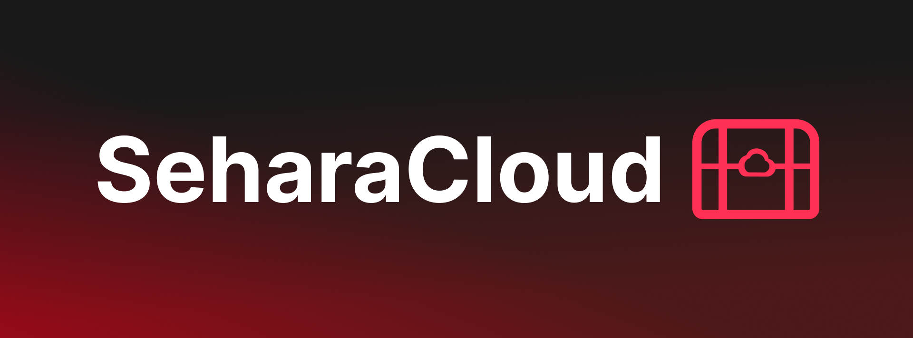
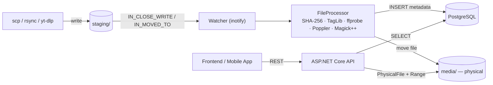

<p align="center">
 
</p>

---
Self-hosted media cloud for music, video, documents, and images. Files are automatically indexed (C++ daemon), metadata is stored in PostgreSQL, and a REST API (ASP.NET Core) serves them to clients (mobile app, web frontend...).

This README covers the backend portion (indexer + API + database + deployment). The frontend builds upon the API contract described here.

---

## Table of Contents

* Architecture
* Tech Stack
* Project Structure
* Getting Started
* Environment Variables (.env)
* appsettings.Production.json
* Indexer — Expectations and Inner Workings
* Database
* API
* Known Issues / Roadmap
* For Frontend Developers

---

## Architecture



### Typical file lifecycle:

1. **File arrives in `staging/**` (scp, rsync, or yt-dlp downloads mp3 directly there).
2. **Watcher captures `IN_CLOSE_WRITE` / `IN_MOVED_TO**` (i.e., only after the write operation is complete — see the atomic write note below).
3. **FileProcessor calculates SHA-256**, checks for duplicates (`fn_find_duplicate`), extracts metadata based on file type, and generates a `.webp` thumbnail if needed.
4. **File is moved from `staging/` to the final physical directory**; the logical path (`/mnt/cloud/...`) is written to the database, not the physical one.
5. **API reads from the database** and serves files from its mount point (same host folder, different path inside the container — see below).
6. **Frontend calls REST endpoints**; `ThumbnailUrl` in the response is already a full URL, ready for `` / `<Image>`.

---

## Tech Stack

| Layer | Technology |
| --- | --- |
| **Indexer** | C++17, libpqxx, TagLib, Magick++, poppler-cpp, OpenSSL, inotify |
| **API** | ASP.NET Core (.NET 9), Dapper, Npgsql |
| **Database** | PostgreSQL 16 (pgcrypto, pg_trgm) |
| **Deployment** | Docker Compose, 3 services: `seharacloud-db`, `seharacloud-api`, `seharacloud-indexer` |

---

## Project Structure

```text
/data/configs/seharacloud/api/
├── client/SeharaCloud.MobileApp/   # Android mobile app
├── database/schema.sql             # complete DDL, seed data, functions
├── docker-compose.yml              # template (without real credentials)
├── docs/ApiContract.md             # full API contract (source of truth for endpoints)
├── env.example                     # template for .env
├── server/
│   ├── api/SeharaCloud.api/        # ASP.NET Core API
│   └── indexer/                    # C++ inotify daemon

```

The repository (this folder) contains template files (`docker-compose.yml`, `env.example`) without real credentials. The actual `.env` and `appsettings.Production.json` files with production values reside separately on the server at `/data/docker/seharacloud/` and are never committed.

---

## Getting Started

**Prerequisites:** Docker, Docker Compose, git.

```bash
git clone https://github.com/SamerKolasevic29/SeharaCloud.git seharacloud
cd seharacloud

# 1. Environment & Config
cp env.example .env
cp appsettings.Production.json.example appsettings.Production.json
# Edit .env and appsettings.Production.json with your actual credentials

# 2. Build & Start Containers
docker compose up -d --build

# 3. Initialize Database (Crucial Step)
docker exec -i seharacloud-db psql -U postgres -d seharacloud-db < database/schema.sql

# 4. Setup Default Thumbnails
# Ensure your host media folders (videos, images, music, documents, thumbnails, staging) exist.
# Copy default thumbnails from the repo to your media/thumbnails/ folder:
cp -r docs/DefaultThumbnails/* /path/to/your/media/thumbnails/
```

## Data Customization & Workflow

By default, every new song processed by the indexer will be assigned to an "Unknown Artist" and "Unknown Genre". If you want your media properly organized, follow these steps before dropping files into the `staging` folder.

### 1. Setting up Genres

You can find pre-made thumbnails for common genres inside `docs/GenreThumbnails`. To add a genre to the database:

* Insert the genre (note that `thumbnail_id1` is already the default fallback, so you only map `thumbnail_id2`):
```sql
INSERT INTO genres (name, thumbnail_id2) 
VALUES ('Rock', 'your-thumbnail-uuid-here');
```


* List your genres to get their IDs for later use:
```sql
SELECT id, name FROM genres;
```


### 2. Setting up Artists & Thumbnails

Find up to two images for your artist (e.g., `Artist.jpg`, `Artist2.png`), place them in a folder, and convert them to the required `.webp` format using this script:

```bash
# Run this inside your image folder to convert jpg/jpeg/png/webp to standard webp
for file in *.{jpg,jpeg,png,webp}; do
  if [ -f "$file" ]; then
    filename=$(basename "$file")
    name="${filename%.*}"
    ffmpeg -i "$file" -vf scale=512:512 "${name}Thumbnail.webp"
  fi
done
```

* Move the generated `ArtistThumbnail.webp` and `Artist2Thumbnail.webp` to your `media/thumbnails/` folder.
* Insert the artist into the database and link them to the previously created genre ID:
```sql
INSERT INTO artists (name, genre_id, thumbnail_id2, thumbnail_id3) 
VALUES ('Smoke Mardeljano', 'genre-uuid-here', 'artist-thumb-uuid', 'artist2-thumb-uuid');
```


### 3. Triggering the Indexer

The indexer relies heavily on filename parsing.

* Rename your audio files exactly to this format: `Artist - SongName.mp3` (or `.wav`).


* Drop them into the `staging/` directory. The indexer will read the filename, match the artist in the database, and link the song. If the filename doesn't match this structure, it falls back to "Unknown Artist".

---

## Environment Variables (.env)

| Variable | Description |
| --- | --- |
| `POSTGRES_USER` | DB user (used by both API and indexer) |
| `POSTGRES_PASSWORD` | DB password |
| `POSTGRES_DB` | Database name (`seharacloud-db`) |
| `DB_HOST` / `DB_PORT` | Internal database hostname/port within the docker network |
| `ASPNETCORE_ENVIRONMENT` | `Production` |
| `API_PORT` | Port the API listens on inside the container |
| `API_BIND_ADDRESS` | Host interface (`127.0.0.1` = local only, behind reverse proxy) |
| `API_BASE_URL` | Public API URL (e.g., `[https://sehara.cloud.com](https://sehara.cloud.com)`) — used for `ThumbnailUrl` and similar absolute links |
| `INDEXER_PHYSICAL_BASE_PATH` | Path as seen by the indexer container |
| `INDEXER_LOGICAL_BASE_PATH` | Path as seen by the API container (`/mnt/cloud`) — this is written to the DB as `path` |
| `HOST_MEDIA_PATH` | Actual path on the server where files reside |
| `HOST_DB_DATA_PATH` | Actual path on the server for the PostgreSQL data directory |

> **Important:** `HOST_MEDIA_PATH` is mounted in both containers, but at different internal paths — the indexer sees it as `PHYSICAL_BASE_PATH` (where it physically writes files), while the API sees it as `LOGICAL_BASE_PATH` (`/mnt/cloud`, where it serves `PhysicalFile` from). Therefore, the database stores the logical path, not the physical one — the API and indexer look at the same disk through two different "windows".

---

## appsettings.Production.json

```json
{
  "AppSettings": { "BaseUrl": "https://sehara.cloud.com" },
  "ConnectionStrings": {
    "DefaultConnection": "Host=seharacloud-db;Port=5432;Database=seharacloud-db;Username=clouduser;Password=..."
  }
}
```

In production, `docker-compose.yml` overrides both keys via environment variables (`AppSettings__BaseUrl`, `ConnectionStrings__DefaultConnection` — double underscore is the ASP.NET Core convention for nested JSON keys). This file serves as a fallback for local runs without Docker.

---

## Indexer — Expectations and Inner Workings

Watcher listens for `IN_CLOSE_WRITE | IN_MOVED_TO` on the staging directory — reacting only when the write operation completes, not when a file is created. Both `scp` (which writes directly to the final name) and `rsync` without `--inplace` (which writes to `.tmp` and renames) are safe for this pattern. For any other source filling the staging folder, the safest approach is write-to-temp + atomic rename on the same filesystem.

### Supported Formats

| Extension | Type | Metadata extracted from |
| --- | --- | --- |
| `.mp3`, `.wav` | Music | TagLib (duration, bitrate) + filename parsing `Artist - Title.mp3` |
| `.mp4` | Video | ffprobe (codec, resolution, duration) |
| `.pdf` | Document | Poppler (page count) |
| `.jpg`, `.jpeg`, `.png` | Image | Magick++ (dimensions + `.webp` thumbnail generation, max 512×512) |

### Deduplication

Each file is hashed (SHA-256) prior to insertion; `fn_find_duplicate()` checks the hash across all four tables (`UNION ALL`). If a duplicate is found, the file is deleted from staging and is not re-indexed.

---

## Database

Full DDL is located in `database/schema.sql` — this is just an overview.

| Table | Purpose |
| --- | --- |
| `thumbnails` | Central table for all thumbnail images (`path`, `mime_type`, dimensions) |
| `genres`, `artists` | Genres and artists, with fuzzy resolution (`pg_trgm`) via `fn_resolve_artist()` |
| `music`, `videos`, `documents`, `images` | Metadata by file type; each contains `size_bytes`, `file_hash`, `thumbnail_id` |

**Sentinel rows** — Unknown Genre, Unknown Artist, and default thumbnails for each file type exist as fixed UUIDs (seed data), protected against deletion by a trigger (`fn_protect_unknown_rows`). **Frontend takeaway:** no genre/artist/thumbnail field is ever `NULL` — a fallback always exists.

**Useful functions:**

* `fn_resolve_artist(name)` — exact match $\rightarrow$ fuzzy match (trigram) $\rightarrow$ fallback to "Unknown Artist"
* `fn_find_duplicate(hash)` — searches hash across all 4 tables
* View `v_artists_full` — artist + all three thumbnails + genre, joined

---

## API

Base URL comes from `API_BASE_URL` (e.g., `[https://api.kolasevic.com](https://api.kolasevic.com)`).
Full contract (including upcoming modules) is in `docs/ApiContract.md` — below is what is currently implemented and verified (Music module).

| Method | Route | Description |
| --- | --- | --- |
| `GET` | `/api/music` | All songs |
| `GET` | `/api/music/recent` | Last 20 (by `indexed_at`) |
| `GET` | `/api/music/artists` | All artists + song count |
| `GET` | `/api/music/artists/search?q=` | Artist search (ILIKE, min 2 characters) |
| `GET` | `/api/music/artists/{artistId}` | Songs by given artist |
| `GET` | `/api/music/genres` | All genres + song count |
| `GET` | `/api/music/genres/{genreId}` | Songs of given genre |
| `GET` | `/api/music/search?q=` | Title search (ILIKE, min 2 characters) |
| `GET` | `/api/music/{id}/stream` | File streaming, supports Range header (RFC 7233) |

`MusicDto`: `Id`, `Filename`, `ThumbnailUrl`, `SizeBytes`, `Title`, `Artist`, `Genre`, `DurationSec`

Short queries (< 2 characters) on search endpoints throw a validation error; `/stream` returns a not-found error if the ID does not exist in the database or if the file is physically missing from disk (`File.Exists` is checked prior to streaming). Exact HTTP status codes mapped by middleware — check `Middleware/` (not covered in this README).

Video/Document/Image endpoints are not yet confirmed in code — once completed, add them to this table following the same format.

---

